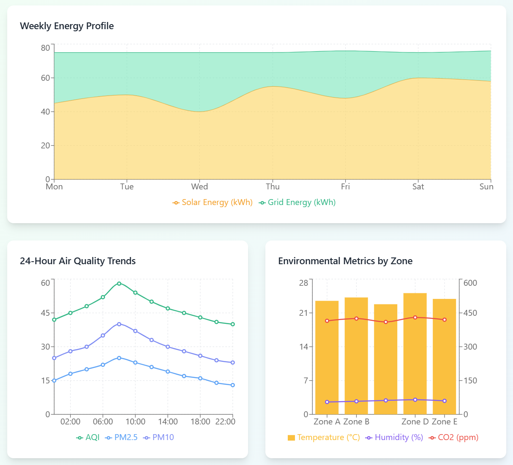

# 🌱 EcoTrack



Version: 1.2.0 | [License: MIT](https://opensource.org/licenses/MIT) | Build: Passing | [Documentation](https://ecotrack.io/docs)

EcoTrack is an open-source environmental monitoring platform that helps communities track, analyze, and respond to local ecological changes. By combining IoT sensor networks with citizen science initiatives, EcoTrack empowers people to become stewards of their local environments.

## 🚀 Features

- **Distributed Sensor Network**: Deploy low-cost, energy-efficient sensors to monitor air quality, water conditions, soil health, and biodiversity indicators
- **Real-time Data Dashboard**: Access environmental metrics through an intuitive web and mobile interface
- **Community Engagement Tools**: Report observations, organize cleanup events, and collaborate on conservation projects
- **Data Analysis Suite**: Visualize trends, receive alerts, and generate reports on environmental conditions
- **Open API**: Integrate with other systems or build custom applications using our comprehensive API

## 📋 Requirements

- Python 3.9+
- Node.js 16+
- PostgreSQL 13+
- Raspberry Pi (for sensor deployments) or compatible microcontrollers

## ⚙️ Installation

### Server Setup

```bash
# Clone the repository
git clone https://github.com/ecotrack/ecotrack.git
cd ecotrack

# Install server dependencies
pip install -r requirements.txt

# Configure your environment
cp .env.example .env
# Edit .env with your configuration settings

# Set up the database
python manage.py migrate

# Start the server
python manage.py runserver
```

### Sensor Node Setup

```bash
cd sensor_firmware
pip install -r requirements.txt

# Configure your sensor
cp sensor_config.example.yaml sensor_config.yaml
# Edit sensor_config.yaml with your sensor specifications

# Flash firmware to your device
python flash.py --device /dev/ttyUSB0
```

### Frontend Setup

```bash
cd frontend
npm install
npm run build
# or for development
npm run dev
```

## 🧪 Running Tests

```bash
# Run backend tests
pytest

# Run frontend tests
cd frontend
npm test
```

## 🗺️ Roadmap

- [ ] Advanced machine learning for predictive environmental modeling
- [ ] Integration with satellite imagery and GIS data sources
- [ ] Expanded biodiversity monitoring capabilities
- [ ] Offline mode for remote sensor deployments
- [ ] Mobile app with augmented reality features

## 👨‍💻 Lead Developer

EcoTrack was developed by Jeremy Mitts, a Machine Learning specialist with expertise in Python, data analysis, and predictive modeling. Jeremy brings experience from Tech Innovators Inc. and Tulsa Data Solutions, where he developed models that improved fraud detection and created data visualization dashboards. His background in natural language processing and collaborative project leadership has been instrumental in creating EcoTrack's intuitive environmental monitoring platform.

Connect with Jeremy at [jeremymitts.com](https://jeremymitts.com/):
- [LinkedIn](https://www.linkedin.com/in/jeremy-mitts/)
- [Twitter](https://x.com/jermitts)
- [Portfolio Projects](https://github.com/jerm014?tab=repositories)

## 👥 Contributing

We welcome contributions from developers, environmental scientists, community organizers, and anyone passionate about environmental monitoring! Please see our [Contributing Guidelines](CONTRIBUTING.md) for more information.

1. Fork the repository
2. Create your feature branch (`git checkout -b feature/amazing-feature`)
3. Commit your changes (`git commit -m 'Add some amazing feature'`)
4. Push to the branch (`git push origin feature/amazing-feature`)
5. Open a Pull Request

## 📄 License

EcoTrack is released under the MIT License. See the [LICENSE](LICENSE) file for details.

## 🌍 Community

- [Community Forum](https://community.ecotrack.io)
- [Discord Server](https://discord.gg/ecotrack)
- [Twitter](https://twitter.com/ecotrackorg)

## 🙏 Acknowledgments

- Thanks to all our contributors and community scientists
- Built with support from the National Environmental Data Initiative
- Inspired by citizen science projects worldwide

---

*EcoTrack: Monitoring our planet together, one sensor at a time.*
